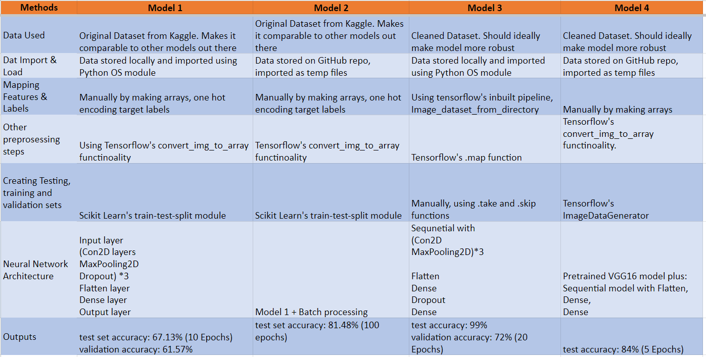

# Flower-Identification-using-deep-learning

**Team members:** Lindsay McCulloch, Sri Penumatcha, Vrinda Patel, Yashada Kulkarni

## Contents

* `Final_Project_Proposal_Team3.docx` containing the project proposal for this project

* `Flower_Identification_Model_1.ipynb` containing the preprocessing of the data and initial CNN model created for this learning model

* `Flower_Identification_Model_2.ipynb` containing the preprocessing of the data and second/alternate CNN model created for this learning model

* `Flower_Identification_Model_3.ipynb` containing the preprocessing of the data and third/alternate CNN model created for this learning model

* `Flower_Identification_Model_4.ipynb` containing the preprocessing of the data and fourth/alternate CNN model and optimisation created for this learning model

* `Flower_Identification_Optimised_Model.ipynb` containing the preprocessing from previous models and model optimisation and predictions on a single final notebook

* `Model_comparison_and_results.png` is the image as shown in the results section of this ReadMe

* `Flower_detection.pptx` is the powerpoint for our teams presentation

* `flowers` folder containing the original dataset from Kaggle.com

    * `daisy` folder containing 764 images of daisies

    * `dandelion` folder containing 1,052 images of dandelions

    * `rose` folder containing 784 images of roses

    * `sunflower` folder containing 733 images of sunflowers

    * `tulip` folder containing 984 images of tulips

* `CleanedDataSet` folder containing a cleaned dataset of images where irrelevant images have been removed from each flower folder

    * `daisy` folder containing 762 images of daisies

    * `dandelion` folder containing 1,050 images of dandelions

    * `rose` folder containing 770 images of roses

    * `sunflower` folder containing 732 images of sunflowers
    
    * `tulip` folder containing 976 images of tulips

## Overview

**Purpose:** The aim of this project is to prepare a data deep dive to show machine learning in the automated identification of flower species based on identifying features in a dataset.

**Data Collection:** We’ve gathered a dataset of flower images, including various species, each labeled with the correct flower name from Kaggle.

**Model Training:** Using CNNs, we have trained our model on this dataset to learn features that distinguish different flowers.

**Prediction:** When users upload flower images, our model will predict the flower type based on the learned patterns.

## Results

**Accuracy:** Model 4 with InceptionV3 transfer learning achieved the highest accuracy of 84.25%

**Data Processing:** Model 4 utilized transfer learning for improved performance

**Model Complexity:** Model 2 had the most advanced architecture with Batch Normalization and data augmentation.

**Training Duration:** Model 2 had the longest training duration with 100 epochs.

In conclusion, Model 4 utilizing transfer learning with InceptionV3 outperformed the other models in terms of accuracy. Model 2 showed significant improvement with advanced techniques, while Model 3 had a simpler architecture but achieved moderate accuracy. Model 1, the basic CNN model, had the lowest accuracy among the four models.

## Requirements

Your assignment will be graded according to the expectations outlined below:

**Data Model Implementation (25 points)**
    
* A Python script initialises, trains, and evaluates a model (10 points)

* The data is cleaned, normalised, and standardised prior to modelling (5 points)

* The model utilises data retrieved from SQL or Spark (5 points)

* The model demonstrates meaningful predictive power at least 75% classification accuracy or 0.80 R-squared. (5 points)

**Data Model Optimisation (25 points)**

* The model optimisation and evaluation process showing iterative changes made to the model and the resulting changes in model performance is documented in either a CSV/Excel table or in the Python script itself (15 points)

* Overall model performance is printed or displayed at the end of the script (10 points)

**GitHub Documentation (25 points)**

* GitHub repository is free of unnecessary files and folders and has an appropriate .gitignore in use (10 points)

* The README is customised as a polished presentation of the content of the project (15 points)

* Group Presentation (25 points)
All group members speak during the presentation. (5 points)

* Content, transitions, and conclusions flow smoothly within any time restrictions. (5 points)

* The content is relevant to the project. (10 points)

* The presentation maintains audience interest. (5 points)

# Acknowledgments 

Dataset provided by Kaggle.com - https://www.kaggle.com/datasets/alxmamaev/flowers-recognition